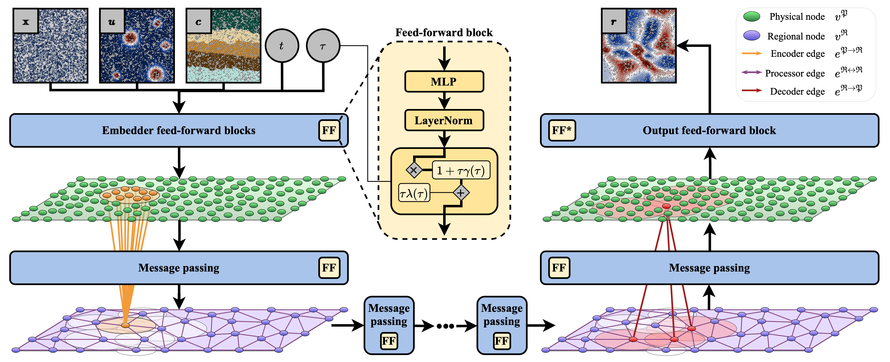
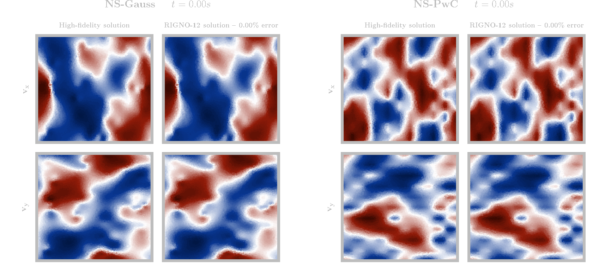

<h1 align="center"> Region Interaction Graph Neural Operator </h1>
<p align="center">  </p>
<h3 align="center"> <a href="https://arxiv.org/abs/2501.19205"> "RIGNO: A Graph-based framework for robust and accurate operator learning for PDEs on arbitrary domains" </a>  </h3>

<h5 align="center">  Sepehr Mousavi, Shizheng Wen, Levi Lingsch, </h5>
<h5 align="center">  Maximilian Herde, Bogdan Raonic, Siddhartha Mishra</h5>


<h4 align="center">  Abstract </h4>

<p align="center">  Learning the solution operators of PDEs on arbitrary domains is challenging due to the diversity of possible domain shapes, in addition to the often intricate underlying physics. We propose an end-to-end graph neural network (GNN) based neural operator to learn PDE solution operators from data on point clouds in arbitrary domains. Our multi-scale model maps data between input/output point clouds by passing it through a downsampled regional mesh. Many novel elements are also incorporated to ensure resolution invariance and temporal continuity. Our model, termed RIGNO, is tested on a challenging suite of benchmarks, composed of various time-dependent and steady PDEs defined on a diverse set of domains. We demonstrate that RIGNO is significantly more accurate than neural operator baselines and robustly generalizes to unseen grid resolutions and time instances. </p>

<hr>

<!-- ## Architecture -->

<p align="center">  </p>

The above figure shows a general schematic of the RIGNO architecture for an idealized two-dimensional domain. The inputs are first independently projected to a latent space by feed-forward blocks. The information on the original discretization (*physical nodes*) is then locally aggregated to a coarser discretization (*regional nodes*). Regional nodes are connected to each other with edges of multiple length scales. Several message passing steps are then applied on the regional nodes which constitute the processor. The processed features are then mapped back to the original discretization by using similar edges as in the encoder, before being independently projected back to the desired output dimension via a feed-forward block without normalization layers.

The following animations illustrate the estimates produced by a RIGNO with 1.9 million parameters trained on 1024 solution trajectories (without fancy pairing strategies) of the incompressible Navier-Stokes equations in a two-dimensional square domain with periodic boundary conditions. All figures corresponds to unstructured versions (random point clouds) of the datasets. The model is trained with snapshots up to time 0.7s; the estimates after this time are considered as extrapolation in time.

<p align="center">  </p>

## Datasets

Follow the instructions in [this Zenodo repository](https://zenodo.org/doi/10.5281/zenodo.14765453) for downloading the datasets, and put them in a data directory with the following structure:
```
.../data/
    |__ poseidon/
        |__ ACE.nc
        |__ ...
    |__ unstructured/
        |__ ACE.nc
        |__ AF.nc
        |__ ...
```


## Minimal example

The `example.ipynb` notebook provides a minimal example on how to use the codes. After setting up the environment, you can run it yourself or experiment with RIGNO by changing the parameters.

## Usage

Create and activate a fresh virtual environment:
```bash
python -m venv venv-rigno
source venv-rigno/bin/activate
```

Install the necessary packages:
```bash
pip install -r requirements.txt
```
> In order to use JAX with GPUs/TPUs, a proper option should be given in `requirements.txt`. Please check [JAX compatibility](https://jax.readthedocs.io/en/latest/installation.html) in order to find the relative option for your hardware. For NVIDIA GPUs, the `[cuda12]` option can be given.

Provided that the dataset is downloaded and placed in `./<dir>/<path>.nc`, you can train a RIGNO on it with the following command:
```bash
python -m rigno.train --datadir '<dir>' --datapath '<path>' --epochs 100 --n_train 512 --n_valid 64
```

For time-independent datasets (`AF` and `Elasticity`), make sure to always pass the `--stepper out` and the `--tau_max 0` flags:
```bash
python -m rigno.train --datadir '<dir>' --datapath 'unstructured/AF' --stepper out --tau_max 0 --epochs 100 --n_train 512 --n_valid 64
```

You can run the following command to see the full list of the command-line arguments of the training module and their default values:
```bash
python -m rigno.train --help
```

When a training is launched, the checkpoints, results, and model configurations will be stored in a specific folder in `./rigno/experiments/`. The path of this folder (`<exp>`) will be printed by the training module. You can check the exact values of the metrics, as well as optimization plots within this folder. It is also possible to provide the training module with an old experiment. Provided that the same configurations of RIGNO are being used, the parameters of the old experiment will be used as initialization of the new training.

Once a training is finished, you can run the test module to assess the performance of a trained model on the test samples:
```bash
python -m rigno.test --exp '<exp>' --datadir '<dir>'
```

The test module infers the model directly (single-step inference with different lead times and input times) and autoregressively (with multiple time marching strategies) and plots the predictions for a few test samples. The most important results will be printed out. Plots and full results can be be found in `./rigno/experiments/<exp>/tests/`. The test module also supports more advanced tests and functionalities which can be enabled via the command-line arguments:
1. testing invariance of the model to different resolutions;
2. testing invariance of the model to different discretizations of the same resolution;
3. testing robustness against noisy inputs; and
4. plotting the statistics of ensemble of estimates with different random seeds.

You can run the following command to see the full list of the command-line arguments of the testing module and their default values:
```bash
python -m rigno.test --help
```

## Citation

```bibtex
@article{mousavi2025rigno,
  title={RIGNO: A Graph-based framework for robust and accurate operator learning for PDEs on arbitrary domains},
  author={Mousavi, Sepehr and Wen, Shizheng and Lingsch, Levi and Herde, Maximilian and Raoni{\'c}, Bogdan and Mishra, Siddhartha},
  journal={arXiv preprint arXiv:2501.19205},
  year={2025}
}
```
