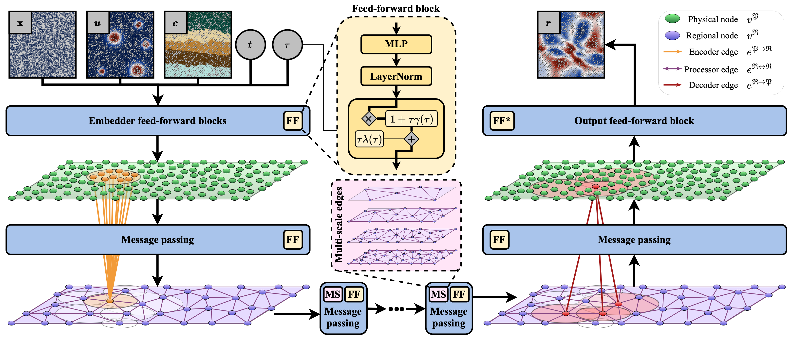

# RIGNO: Region Interaction Graph Neural Operator
Codes for the paper "RIGNO: A Graph-based framework for robust and accurate operator learning for PDEs on arbitrary domains"

## Abstract
Learning the solution operators of PDEs on arbitrary domains is challenging due to the diversity of possible domain shapes, in addition to the often intricate underlying physics. We propose an end-to-end graph neural network (GNN) based neural operator to learn PDE solution operators from data on point clouds in arbitrary domains. Our multi-scale model maps data between input/output point clouds by passing it through a downsampled regional mesh. Many novel elements are also incorporated to ensure resolution invariance and temporal continuity. Our model, termed RIGNO, is tested on a challenging suite of benchmarks, composed of various time-dependent and steady PDEs defined on a diverse set of domains. We demonstrate that RIGNO is significantly more accurate than neural operator baselines and robustly generalizes to unseen grid resolutions and time instances.

The main processing of the input functions happens in the space of a low-resolution mesh with nodes that each represent a sub-region of the domain. The following figure draws a schematic of how the information is transmitted from the original space discretization to the "regional mesh" and vice-versa.

<p align="center">  </p>

## Results

The following figure illustrates the estimates produced by a RIGNO with 2.7 million parameters trained on 1024 solution trajectories of the incompressible Navier-Stokes equations in a two-dimensional square domain with periodic boundary conditions. The time difference between the input and the output is 0.7s. The learned operator is inferred 7 times autoregressively.

<p align="center">  </p>

<p align="center">  </p>

## How to use

Train a model with default settings:
```bash
python -m rigno.train --datadir 'path_to_data' --datapath 'relative_path_to_dataset' --epochs 20 --batch_size 2 --n_train 128 --n_valid 128
```
